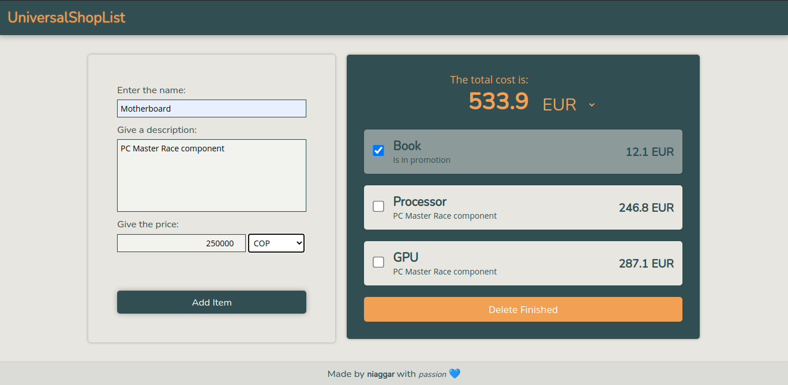
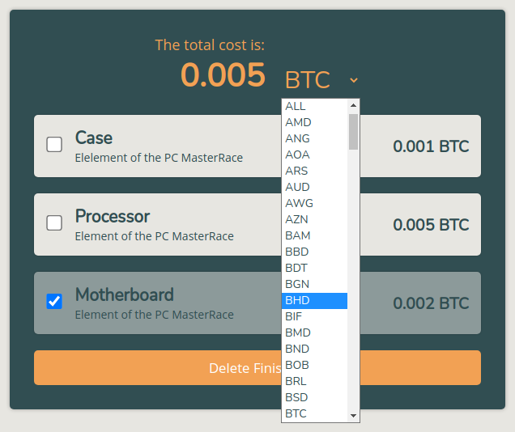

UniversalShopList
=======================

> The Responsive is on progress...

This is an application to control a ShopList in different currencies. It is built using JavaScript, CSS, EJS and Node.

The conversion of each currency is updated thanks to the use of API [Fixer.io](https://fixer.io/).

ScreenShots of the interface:

----

Made by **niaggar** with *passion* 💙
